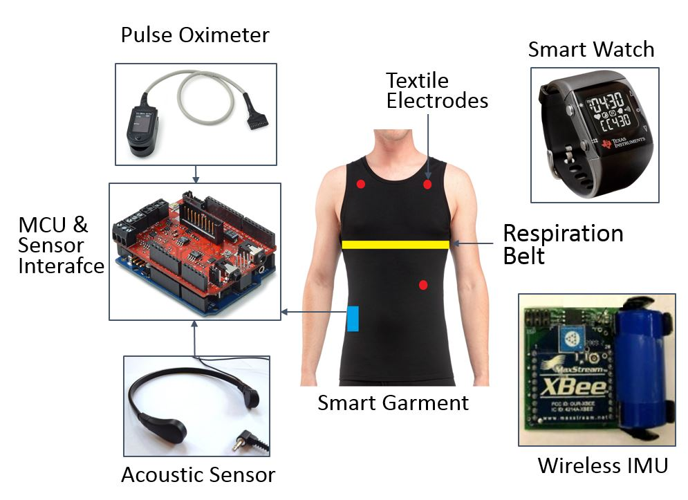

## Inspiration
At the time of 2010, almost 60 million people, about 19 percent of the population, lived in rural areas of the United States. Rural residents have greater transportation difficulties reaching health care providers, often traveling great distances to reach a doctor or hospital. The patient-to-primary care physician ratio in rural areas is only 39.8 physicians per 100,000 people, compared to 53.3 physicians per 100,000 in urban areas. In addition, rural residents tend to be poorer. On average, per capita income in rural areas is $9,242 lower than the average per capita income in the United States, and rural Americans are more likely to live below the poverty level [according to NRHA]

The situation is even worse in Oklahoma, with 30% of the population living in rural areas. “It takes a long time to get anywhere from Eufaula,” said Joy Sloan, chief executive officer of Green Country Behavioral Health, which operates in Muskogee and McIntosh counties. “And if you don’t have transportation or good transportation, you could be sitting somewhere for a long time waiting for help". Therefore, there is a strong need for an innovative solution to help rural residents in Oklahoma and in America to access healthcare services.

** The motivation to help rural people led us to RuralCare, an innovative mobile app that combines the power of mobile app, cloud computing, and wireless sensors to benefits rural residents and healthcare providers. **

## What it does
Ruralcare aims at providing a home health service which has following features:
-	Monitor biomedical data of human.
-	Detect body activities via motion sensor
-	Monitor hydration via drinking sound detection 
-	Monitor negative emotion via heart signal
-	Provide doctors/caregivers a visually real-time health metrics
-	Provide healthcare delivery via video call from doctors or home robot assistant
## How we built it
### Wearable unit
The wearable unit is worn by the human and is used to collect physiological signals and activity data. The data collected from this system include electrocardiogram (ECG), blood oxygen concentration (SpO2), respiration rate, acoustic activity, and body activity. The signals are sampled and framed using a low cost Arduino-based MCU and a sensor interface board. The data are time-stamped to allow synchronization with environmental sensors in the smart home. The components of the wearable unit are shown in Fig.1. Below we describe the function of each component.

Fig. 1. The components of the wearable unit.

* Smart garment: 
The prototype smart garment includes textile ECG electrodes and a respiration belt. A single lead ECG signal is collected from the garment using the Lead-II configuration. The signal is amplified and sampled at a rate of 250 Hz, which is sufficient for detecting heart rate, studying heart rate variability and arrhythmias. The ECG signal is preprocessed by applying the Pan Tompkins algorithm, which performs a bandpass filter(5–15 Hz), a derivating filter to highlight the QRS complex. Thus, the RR interval is calculated, which is used to infer the user’s heart rate. The respiration belt is an inductive transducer which measures the changes in thoracic or abdominal circumference during respiration. These measurements can indicate inhalation, expiration, and breathing strength which can be used to derive breathing rate. The respiration rate of a normal adult is around 12–30 breaths per minute, and in our system we selected the sampling rate of 20 Hz, which is sufficient to capture the respiratory signal, and a low pass filter with a cutoff frequency of 0.1 Hz is applied.
* Pulse Oximeter: 
The Pulse Oximeter is a non-invasive device used to estimate arterial oxygen saturation which refers to the amount of oxygenated hemoglobin in the blood. The SpO2 signal is sampled at 20 Hz and is collected several times a day depending on the need.
* Smartwatch: 
The eZ430-Chronos Smartwatch is used to collect hand motion data. It uses a CC430F6137 MCU with a 915 MHz wireless transceiver. The watch integrates a 3D accelerometer. The accelerometer signal is wirelessly transmitted to the home gateway at 33 Hz.
* Acoustic sensor: 
A throat microphone is used to record audio signals from the throat area. The throat microphone senses vibrations from the wearer’s throat instead of sound signals which allows picking up sounds in noisy and windy environments. It has a sensitivity of −66 dB ± 3 dB and can pick up sound signals from 20 Hz–16 000 Hz which is sufficient for detecting various throat activities. 
* Inertial Measurement Unit (IMU): 
We used our custom built wireless IMU to collect body activity information. The IMU node we developed consists of a VN-100 orientation sensor module from VectorNav, Inc. for motion sensing, an XBee RF module for wireless communication, and a power management unit to prolong the battery life. The motion data include orientations (roll, pitch, and yaw), 3D acceleration, 3D angular rate, and 3D magnetic field.

### Home gateway:
The data of all sensors are sent to a home gateway where the signals are preprocessed and input to pre-trained classification models . Then, raw data and inferred outputs are uploaded to Amazon cloud.

Several models have been built based on both online and our own collected datasets. For example:
* Body activity recognition
* Drinking sound detection
* Negative emotion detection
### Amazon AWS Cloud: 
An instance EC2 is created to feature a web server running PHP and a MySQL database server. All data from the gateway are sent to the database, then visually shown in frontend interface. Residents and doctors can use Web/Mobile App to see in real-time all the visualized health data. More importantly, alerts/notifications are triggered whenever the resident is at risk, for example when he or she is recognized as angry, depressed, dehydrated. The remote caregiver may double check the real-time visualized health data shown in the app, or can set up voice call or video call to the resident. This forms a closed-loop healthcare system that provides timely healthcare delivery services.
## Challenges we ran into

## Accomplishments that we're proud of

## What we learned

## What's next for RuralCare

## Challenges we ran into
We ran into three challenges: limitted time budget, AWS learning curve and system integration.
### Limitted Time Bugdet
This is our biggest challenge. We knew about the AWS IoT App Challenge only 21 days before deadline. It also took us a week to discuss about the challenge theme, our chance, and team setup. Therefore, there were technically less than 2 weeks left for us to brainstorm ideas, design, implementation/test and deploy our RuralCare systems. As a result, We had to turn off many cool features because we did not have enough time to implement them. There are also some helpful features that we built as prototype for proof of concepts.
### AWS Learning Curve
Both two members in our team are AWS beginners. Minh is working on smart home, robotics and machine learning research topics. Tuan is working on hardware VLSI design and studying AWS IoTs and Alexa Apps as hobbies and he has some experiences in working with AWS MQTT and EC2. To participate in this challenge, we both had to learning AWS IoTs concepts/tools/practices and it took us a significant portion of time before we can deploy our system.
### System Integration
The program running on the gateway was originally written in Matlab. It collects data from multiple sensing sources with different protocols like Bluetooth and Xbee , and performs signal processing. It is difficult for Matlab to interact with the AWS in terms of using AWS IoT and Kinesis. So, from Matlab we run predictive models and directly uploaded the data to the database in the EC2 instance. 

We are converting the Matlab code into Python so that it can work efficiently with AWS. The predictive models have been converted into Python. We have uploaded the models to the EC2 and been trying to integrate them with APIs using Chalice. However, there are some bugs that we need to figure out.

## Accomplishments that we're proud of

## What we learned

## What's next for RuralCare
First, we need to accomplish our system with complete features that we wanted to do at the beginning
Second, we will try to remove the gateway. It means that all sensors will be collected and preprocessed on the sensors' board and the data will be uploaded to AWS usng AWS IoT
